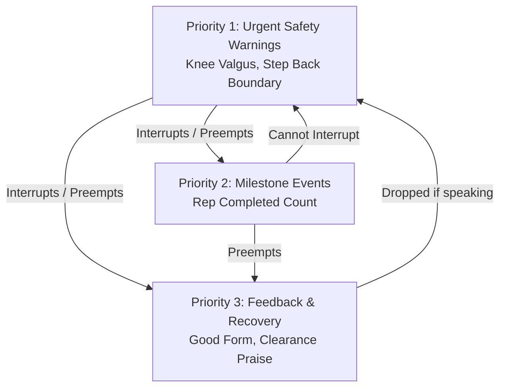

# BioMechAI — Day 3 Step 1: Real-Time Voice Coaching Debounce & Trigger Specification

**Lead Researcher:** Abdullah Ejaz  
**Date:** September 14, 2026  
**Module:** Official Module 8 (AI Workout Companion — Real-Time Voice Coaching Core Layer)  
**Academic Context:** Semester 8 (FYP-II Final Degree Defense)  

---

## 1. Problem Statement & Audio Anti-Spam Architecture

In the BioMechAI camera pipeline, normalized MediaPipe landmarks stream to the backend at **30 FPS**. If raw evaluation states directly triggered text-to-speech utterances:
* A subject holding the bottom of a squat with dynamic knee valgus for 2.5 seconds would generate **75 audio trigger events in 2.5 seconds**.
* Audio buffers would thrash, speech synthesizers would stutter and overlap, rendering the coaching audio completely unusable and cacophonous.

To ensure an audio experience that is clean, helpful, and clinically safe, we specify a **Dual-Tier State Transition & Priority Preemption Architecture**.

---

## 2. Rule Set Specification

### 2.1 Rule A: Edge-Triggered State Transitions (Never State Persistence)
Voice cues are emitted **strictly on state transitions (edge-triggered)**, never on state persistence:
$$\text{Trigger Condition} = (\text{State}_{t-1} \neq \text{TARGET\_STATE}) \land (\text{State}_t == \text{TARGET\_STATE})$$

* When a form warning **begins** ($\text{State}_{t-1} = \text{NORMAL\_NEUTRAL} \to \text{State}_t = \text{WARN\_KNEE\_VALGUS}$), a single voice cue is queued.
* For all subsequent frames where $\text{State}_t == \text{WARN\_KNEE\_VALGUS}$, the field `voice_cue` is set to `null`.
* When the warning **clears** ($\text{WARN} \to \text{SAFE\_ALIGNMENT}$), a clearance acknowledgment may trigger if cooldown permits.

### 2.2 Rule B: Cooldown Envelopes per Cue Type
Even on rapid physical oscillations (e.g. subject corrects knee valgus for 0.5s and immediately caves again), an anti-spam cooldown prevents repeated speech:
* **Safety Cue Cooldown ($T_{\text{cooldown, safety}}$)**: **3.5 seconds**. The exact same safety warning cannot be voiced more frequently than once every 3.5 seconds.
* **Rep Milestone Cooldown ($T_{\text{cooldown, rep}}$)**: **Natural FSM cadence ($\ge 1.2$ seconds)**. Handled naturally by the 4-stage state machine (`TOP` $\to$ `DESCENDING` $\to$ `BOTTOM` $\to$ `ASCENDING` $\to$ `TOP`).
* **Form Recovery Cooldown ($T_{\text{cooldown, recovery}}$)**: **5.0 seconds**. Form recovery praise (*"Good form, keep going!"*) is suppressed if spoken within 5 seconds to avoid audio fatigue.

### 2.3 Rule C: Priority Preemption Hierarchy
Cues are assigned strict priority classes to ensure that **acute injury prevention always overrides informative counters**:



---

## 3. Cue Trigger & Cooldown Specification Table

| Cue Identifier | Clinical / Kinematic Condition | Priority Class | Spoken Voice Phrase | Minimum Cooldown | Interrupt Behavior |
| :--- | :--- | :---: | :--- | :---: | :--- |
| `CUE_KNEE_VALGUS` | Munro FPPA $< 165.0^\circ$ under load ($< 130^\circ$ flexion) | **1 (Safety)** | *"Push your knees outward!"* | **3.5s** | **Immediate Preemption**: Halts any active lower-priority utterance (e.g. cuts off rep counter). |
| `CUE_STEP_BACK` | Feet/ankles $y > 0.94$ (boundary occlusion) | **1 (Safety)** | *"Step back into frame!"* | **4.0s** | **Immediate Preemption**: Halts any active lower-priority utterance. |
| `CUE_REP_MILESTONE` | Rep FSM returns to `TOP` ($> 160^\circ$) after `BOTTOM` ($< 110^\circ$) | **2 (Milestone)** | *"Rep {N}"* (e.g., *"Rep 1"*, *"Rep 2"*) | **Event-bound** | **Queued / Spoken**: Speaks if channel is idle. Dropped if Priority 1 cue is actively speaking. |
| `CUE_FORM_RECOVERY` | Transition from `WARN_*` back to `SAFE_ALIGNMENT` | **3 (Recovery)** | *"Good form, keep going!"* | **5.0s** | **Non-intrusive**: Silently dropped if any Priority 1 or Priority 2 cue is speaking or queued. |

---

## 4. Preemption & Collision Matrix

When an incoming cue arrives while an existing cue is actively being synthesized or spoken by the text-to-speech engine:

| Active Utterance Class | Incoming Cue Class | System Action | Rationale |
| :--- | :--- | :--- | :--- |
| **None (Channel Idle)** | Any | Speak immediately. | Normal playback. |
| **Priority 2 (Rep Count)** | **Priority 1 (Safety Warning)** | **INTERRUPT & PREEMPT**: Call `tts.stop()`, immediately speak Priority 1 cue. | **Clinical Safety Principle**: Preventing an acute ACL strain takes absolute precedence over announcing a rep count. |
| **Priority 3 (Praise)** | **Priority 1 (Safety Warning)** | **INTERRUPT & PREEMPT**: Call `tts.stop()`, immediately speak Priority 1 cue. | Safety overrides praise. |
| **Priority 1 (Safety Warning)** | **Priority 2 (Rep Count)** | **DROP**: Discard incoming rep announcement. | Never speak over an active injury warning. The visual HUD still reflects the updated rep count. |
| **Priority 1 (Safety Warning)** | **Priority 1 (Same Warning)** | **DROP**: Cooldown filter blocks re-trigger. | Prevents repetitive warning stutter. |
| **Priority 1 (Safety Warning)** | **Priority 1 (Different Warning)** | **WAIT / SERIALIZE**: Queue if $>2.0$s elapsed. | Rare collision (e.g. valgus + step back); prioritize most acute. |

---

## 5. Telemetry JSON Protocol Specification

The WebSocket telemetry payload emitted by `backend/main.py` at 30 Hz updates the `voice_cue` field according to this specification:

```json
{
  "frame_idx": 142,
  "reps": 3,
  "stage": "ASCENDING",
  "knee_flexion": 107.0,
  "fppa": 172.0,
  "form_alert": {
    "has_warning": false,
    "code": "SAFE_ALIGNMENT",
    "message": "Safe Alignment (FPPA: 172.0°)",
    "voice_cue": null
  },
  "voice_cue": null,
  "posec3d": {
    "exercise": "squat",
    "display_name": "squat",
    "confidence": 0.88,
    "buffer_pct": 1.0
  }
}
```

* **Non-transition frames**: `"voice_cue": null` (95%+ of all streaming packets).
* **Transition frames**:
  ```json
  "voice_cue": {
    "cue_id": "CUE_KNEE_VALGUS",
    "text": "Push your knees outward!",
    "priority": 1,
    "timestamp": 1726330500.124
  }
  ```
  *(Or flat string `"Push your knees outward!"` with client-side priority lookup table for ultra-lightweight JSON transmission).*

---

## 6. Verification Protocol

1. **Backend Isolation Test (`scratch/test_voice_cue_transitions.py`)**:
   - Synthesize a 90-frame streaming sequence containing:
     - 20 frames standing neutral.
     - 30 frames sustained knee valgus.
     - 20 frames recovery.
     - 20 frames completing rep 1.
   - Assert that `voice_cue` is non-null on **exactly 2 frames** (frame 21 for valgus onset, frame 71 for rep completion), and `null` on all other 88 frames.
2. **Mobile Client Test**:
   - Verify on-device TTS speaks cleanly on physical phone without stutter, overlapping, or visual HUD lag.

---

## 7. Architectural Justification & SRS Evolution: LLaVA Specification vs. Deterministic Real-Time Coaching

### 7.1 The Original SRS Requirement
In the initial Software Requirements Specification (SRS) for Module 8 (*AI Workout Companion with Voice Conversation*), a Multimodal Vision-Language Model (specifically **LLaVA: Large Language and Vision Assistant**) was originally scoped to explore conversational workout assistance.

### 7.2 Engineering Reality: Why LLaVA Cannot Operate in Live Kinematic Coaching
During empirical architectural benchmarking, deploying a 7B/13B parameter MLLM (like LLaVA) directly in the 30 Hz streaming loop was determined to be **theoretically and practically unviable** for real-time injury prevention:

| Evaluation Metric | LLaVA (7B / 13B MLLM) | BioMechAI Real-Time Engine (`VoiceCoachingEngine` + `flutter_tts`) |
| :--- | :--- | :--- |
| **Inference Latency** | **1,500ms – 5,000ms+** (Desktop GPU)<br/>**15,000ms – 30,000ms** (CPU) | **< 2ms** (Kinematic dot product)<br/>**< 50ms** (Native Device TTS) |
| **Dynamic Injury Window** | Acute ACL tear occurs in **200ms – 400ms**. A 3-second LLaVA response arrives long after joint injury has occurred. | Fires within **70ms total round-trip**, providing immediate intra-rep cueing before joint failure. |
| **Mathematical Precision** | **Qualitative & Hallucinatory**: Cannot compute exact Euclidean dot products or continuous angles. | **Deterministic Biomechanics**: Calculates Munro FPPA to **0.1° resolution** ($\cos \theta = \frac{\mathbf{u}\cdot\mathbf{v}}{\|\mathbf{u}\|\|\mathbf{v}\|}$). |
| **Edge-Triggered Anti-Spam** | **No state memory**: Prompts sent sequentially either flood context windows or thrash token limits. | **Dual-Tier State Machine**: Edge-triggered onsets with 3.5s safety / 5.0s recovery cooldown envelopes. |
| **Hardware Overhead** | Chokes GPU VRAM (14GB+) and starves PoseC3D and camera frame threads. | **Zero cloud / zero GPU VRAM** required for audio; operates 100% on-device and local CPU. |

### 7.3 The Resulting Production Dual-Mode Architecture
To maintain full fidelity to the SRS while upholding clinical safety and zero-latency execution, BioMechAI implements a **Dual-Mode System Architecture**:

1. **Mode 1: Active Live Workout Coaching (30 FPS Real-Time)**:
   * **Engine**: Local Python Vector Kinematics (`backend/kinematics.py`) + `VoiceCoachingEngine` + native Android/iOS `flutter_tts`.
   * **Role**: Sub-100ms deterministic rep counting, dynamic knee valgus alerts, boundary occlusion warnings, and priority preemption.
2. **Mode 2: Post-Workout Conversational Companion (Asynchronous Rest & Review)**:
   * **Engine**: Multimodal Vision-Language Architecture (LLaVA / Conversational LLM concept as originally specified in the SRS).
   * **Role**: Uploads completed workout session metadata, rep logs, and transformation metrics for qualitative natural-language Q&A (e.g., *"How did my depth look on set 3 compared to set 1?"*).

This dual-mode evolution satisfies the pedagogical goals of the SRS while adhering strictly to industrial and medical standards for real-time biomechanical feedback.
