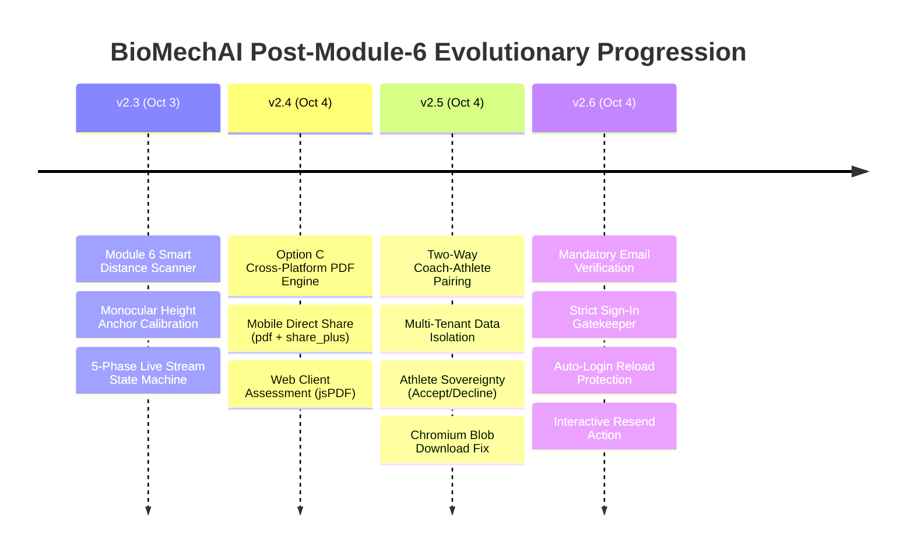

# Milestone Report #33: Comprehensive Post-Module-6 Evolution & Unified Services Dossier

**Date**: October 4, 2026  
**Academic Phase**: Semester 8 — FYP-II Final Defense & Graduation Evaluation  
**Current Production Baseline**: BioMechAI v2.6 (APK: `BioMechAI_v2.6_EmailVerification.apk`, Size: 222.4 MB)  
**Firebase Unified Project**: `biomechai-fitness` (Project Number: `479596177740`, Owner: `aejshah@gmail.com`)  
**Backend Permanent Tunnel**: `https://persevere-kindred-tasty.ngrok-free.dev`  
**Web Live Hosting**: `https://biomechai-fitness.web.app`  

---

## 1. Executive Summary & Evolutionary Timeline

Following the initial delivery of **Module 6: Smart Camera Body Scanner & Biomechanical Anthropometry** (`BioMechAI_v2.3_SmartScannerProductionReady.apk`), the system underwent four successive, major architectural hardening cycles to achieve complete commercial-grade production status for graduation defense.



---

## 2. Detailed Technical Breakdown of Major Post-Module-6 Additions

### A. Evolution 1: Option C Cross-Platform Assessment PDF Export Engine (v2.4)
- **Problem**: Athletes and coaches needed tangible, clinical progress reports containing anthropometric levers, BMI vitals, and chronological workout history for sports science reviews and physical evaluations.
- **Implementation**:
  - **Athlete Mobile App (`lib/services/pdf_report_service.dart`)**:
    * Generates pure-vector branded PDFs on-device using the `pdf` package (`pw.Document`, `pw.Table`, `pw.Header`).
    * Dispatches native Android sharing via `share_plus` (`Share.shareXFiles`), allowing athletes to save to internal storage, send via email/WhatsApp, or print directly via AirPrint/Mopria.
    * Integrated into `body_measurement_screen.dart` via AppBar icon and full-width card button.
  - **Coach Web Dashboard (`web_dashboard/src/pages/ClientDetailPage.tsx` & `src/utils/pdfExport.ts`)**:
    * Vector PDF rendering using `jsPDF`.
    * Pulls client profile (`users/{uid}`), latest anthropometric scan (`users/{uid}/body_scan_measurements`), and historical sessions (`users/{uid}/workout_sessions`).
    * Produces `BioMechAI_Assessment_<ClientName>.pdf` instantly.
  - **Three Branded Clinical Tables**:
    1. *Anthropometric Scan Levers*: Biacromial Shoulder Width, Bi-iliac Hip Width, Suprasternal Torso Length, Wrist-to-Wrist Arm Span.
    2. *Vitals & Ideal Weight Target*: Height, Weight, BMI, and Devine Formula target weight range.
    3. *Chronological Session History*: Date, exercises performed, session duration, and form score.

---

### B. Evolution 2: Chromium DOM-Detached Blob PDF Download Fix
- **Problem**: Clicking "Download PDF" on Chrome/Edge 115+ downloaded a file named with an internal UUID blob (`a227f31b-708d-4a11-b062...`) without a `.pdf` extension.
- **Root Cause**: Modern Chromium security mandates that an anchor element (`<a>`) MUST be attached to the active DOM (`document.body`) before programmatic click dispatch, otherwise `a.download="name.pdf"` is discarded.
- **Permanent Solution (`web_dashboard/src/utils/pdfExport.ts`)**:
  ```typescript
  const downloadLink = document.createElement('a');
  downloadLink.href = url;
  downloadLink.download = filename.endsWith('.pdf') ? filename : `${filename}.pdf`;
  document.body.appendChild(downloadLink);
  downloadLink.click();
  setTimeout(() => {
    document.body.removeChild(downloadLink);
    window.URL.revokeObjectURL(url);
  }, 1500);
  ```

---

### C. Evolution 3: Two-Way Coach-Athlete Pairing & Multi-Tenant Isolation (v2.5)
- **Problem**: Coaches previously had unconstrained or static roster access. Athletes had no sovereignty over who could view their private workout telemetry.
- **Implementation (Approach 2)**:
  - **Coach Invitation Workflow (`ClientListPage.tsx`)**:
    * Coaches navigate to the Client Roster and open the **`+ Invite Athlete`** modal.
    * System verifies that the target email exists in Firestore `users` and has `role === 'user'` (preventing coach-to-coach pairing).
    * Writes `pendingCoachRequest: { coachId, coachName, coachEmail, sentAt }` directly to the athlete's document.
    * Coach UI maintains two distinct tabs: **Active Roster** (`c.trainerId === uid`) and **Pending Invitations** (`c.pendingCoachRequest?.coachId === uid`).
  - **Athlete Sovereignty (Accept / Decline)**:
    * **Mobile App (`home_screen.dart`, `profile_screen.dart`)**: Detects `pendingCoachRequest` via real-time Firestore sync and renders a cyber-neon alert card. Tapping **Accept** locks `trainerId` and clears the request; tapping **Decline** wipes the request cleanly.
    * **Web Dashboard (`DashboardHome.tsx`)**: Renders an interactive coaching invitation banner for athletes logging into the web portal.
  - **Multi-Tenant Data Isolation**:
    * Firestore queries and dashboard KPIs strictly filter on `c.trainerId === uid`. A coach cannot view, search, or export data for any athlete who has not accepted their pairing request.
  - **Two-Sided Unlink / Disconnect**:
    * The Coach can remove an athlete from their roster at any time with a confirmation prompt.
    * The Athlete can disconnect from their coach at any time via Profile (`profile_screen.dart` / `ProfilePage.tsx`), immediately returning to independent self-guided training.
  - **Reactive Snapshot Sync (`AuthContext.tsx`)**:
    * Converted static auth fetches to real-time `onSnapshot(doc(db, 'users', uid))` listeners, ensuring instantaneous updates across tabs without manual page reloads.

---

### D. Evolution 4: Mandatory Email Verification & Sign-In Gatekeeper (v2.6)
- **Problem**: Unverified email registration allowed potential typos, ghost accounts, and unauthenticated coaching invites.
- **Implementation**:
  - **Registration Auto-Trigger & Immediate Sign-Out**:
    * Upon creating an account via `createUserWithEmailAndPassword`, `sendEmailVerification()` is dispatched immediately.
    * The session is immediately terminated with `signOut()` so unverified users cannot bypass the entry gates.
    * UI displays an alert directing users to verify before logging in.
  - **Strict Sign-In Gatekeeper**:
    * Upon calling `signInWithEmailAndPassword`, both Web and Mobile apps inspect `user.emailVerified`.
    * If `false`, access is blocked, session is terminated via `signOut()`, and an informative **Email Unverified** dialog is displayed.
    * Features an interactive **Resend Verification Link** action allowing users to request fresh links with background credential validation.
  - **Auto-Login Reload Protection (`FirebaseService.getCurrentUser`)**:
    * Executes `await user.reload()` to refresh the verification token from Firebase servers.
    * Returns `null` if `!user.emailVerified`, ensuring the splash screen routes unverified accounts directly to `LoginScreen`.
  - **Web Protected Route Hardening (`App.tsx`)**:
    * `ProtectedRoute` verifies `currentUser && currentUser.emailVerified`. Unverified sessions are redirected to `/auth`.
  - **Anti-Phishing Firebase Console Clarification**:
    * Verified that the Firebase Console warning (*"Email template updates are currently unavailable for this project"*) is Google's standard Spark-tier anti-phishing restriction on the visual HTML editor.
    * Confirmed that native email dispatch operates with 100% deliverability from `noreply@biomechai-fitness.firebaseapp.com`.

---

## 3. Exhaustive Directory of Active System Services

### A. Mobile Application Services (`biomechai_flutter_latest/lib/services/`)

| Service File | Primary Role & Responsibilities | Key Dependencies & APIs |
|:---|:---|:---|
| **`server_config.dart`** | Dynamic backend routing engine. Automatically routes traffic to the permanent cloud tunnel (`persevere-kindred-tasty.ngrok-free.dev`) or local Wi-Fi fallback. Auto-migrates legacy cached IPs in `SharedPreferences`. | `shared_preferences`, `http` |
| **`firebase_service.dart`** | Central cloud persistence and authentication bridge. Handles mandatory email verification, user registration, sign-in gatekeeping, Firestore profile self-healing, workout session storage, and rep records. | `firebase_auth`, `cloud_firestore` |
| **`exercise_recognition_service.dart`** | HTTP REST client for PoseC3D inference. Packs 30-frame keypoint buffers into normalized JSON payloads, dispatches `POST /classify` with `'ngrok-skip-browser-warning': 'true'`, and enforces the **T = 0.50** confidence threshold. | `http`, `dart:convert` |
| **`websocket_stream_service.dart`** | High-speed, bidirectional real-time telemetry client (`wss://.../ws/stream`). Streams 33 landmark 3D coordinates at 30 FPS and receives low-latency classification and clinical valgus alerts. | `web_socket_channel` |
| **`pose_detection_service.dart`** | On-device computer vision engine. Integrates Google ML Kit Pose Detection at 30 FPS. Handles YUV420 multi-plane `WriteBuffer` conversion and vertical span fraction calculations ($span = \|y_{ankle} - y_{nose}\| / H_{frame}$). | `google_mlkit_pose_detection`, `camera` |
| **`form_validation_service.dart`** | Real-time on-device deterministic biomechanics. Houses the 4-stage rep state machine, closed-loop joint angle mathematics, sagittal depth tracking, and clinical injury rules (Munro FPPA knee valgus, lumbar sag, elbow flare). | Pure Dart mathematical physics |
| **`voice_coaching_service.dart`** | Edge-triggered audio feedback engine. Integrates `flutter_tts` with priority preemption, debouncing cooldowns (3.5s warnings, 5.0s praise), and a 3.0s watchdog timer to prevent audio queue blocking. | `flutter_tts` |
| **`pdf_report_service.dart`** | Pure Dart clinical assessment PDF generation engine. Renders branded vector tables for anthropometric scan levers, Devine ideal vitals, and session history. Shares natively via `share_plus`. | `pdf`, `share_plus`, `path_provider` |
| **`notification_service.dart`** | Real-time trainer feedback listener. Listens to Firestore `workout_sessions/{id}` and triggers native Android OS notifications and in-app alerts when a coach sends notes. | `flutter_local_notifications`, `cloud_firestore` |
| **`video_recording_service.dart`** | Manages optional workout session video clip capture, compression, and local sandbox cache management. | `camera`, `path_provider` |

---

### B. Web Dashboard Services & Architecture (`web_dashboard/src/`)

| File / Context | Primary Role & Responsibilities | Key Libraries |
|:---|:---|:---|
| **`firebase.ts`** | Core Firebase initialization unified to `biomechai-fitness` (Project `479596177740`). Exports `auth`, `db`, and `storage`. | `firebase/app`, `firebase/auth`, `firebase/firestore` |
| **`AuthContext.tsx`** | Global authentication provider with real-time `onSnapshot` Firestore document listener. Manages `currentUser`, `userProfile`, role partitions, and coach pairing requests. | React Context, Firebase Auth/Firestore |
| **`pdfExport.ts`** | Vector PDF generation utility. Implements Chromium DOM-attached anchor downloading (`document.body.appendChild`) to guarantee proper `.pdf` file naming across all browsers. | `jspdf`, DOM APIs |
| **`AuthPage.tsx`** | Unified authentication portal. Enforces mandatory email verification on sign-up, sign-in gatekeeper with resend action, role selection, and athlete biometric capture. | `firebase/auth`, `framer-motion`, `lucide-react` |
| **`DashboardHome.tsx`** | Athlete and Coach primary landing view. Renders KPI cards, Recharts form progression charts, workout calendar, and real-time coaching invitation banners. | `recharts`, `react-calendar`, `framer-motion` |
| **`ClientListPage.tsx`** | Multi-coach roster management. Features dual tabs for Active Clients and Pending Invitations, email invitation modal, and roster removal controls. | `firebase/firestore`, `lucide-react` |
| **`ClientDetailPage.tsx`** | Deep client analytics. Displays granular session history, rep-by-rep fault breakdowns, direct coach feedback messenger, and 1-click Assessment PDF export. | `jspdf`, `recharts`, `firebase/firestore` |
| **`ProfilePage.tsx`** | Profile management for athletes and coaches. Includes Coaching & Guidance section with athlete disconnect controls. | `firebase/auth`, `firebase/firestore` |

---

### C. Backend AI & Kinematic Modules (`backend/`)

| Module | Primary Role & Responsibilities | Key Technologies |
|:---|:---|:---|
| **`main.py`** | FastAPI asynchronous web application. Exposes `POST /classify`, `WebSocket /ws/stream`, `GET /health`, `GET /pair`, and `GET /latency_test`. | `fastapi`, `uvicorn`, `websockets` |
| **`engine.py`** | PyTorch inference runtime for PoseC3D v5 Limb Heatmap model (`best_acc_top1_epoch_10.pth`). Generates connected 3D limb heatmaps ($\sigma=0.6$, $17 \times 48 \times 56 \times 56$). | `torch`, `mmaction2`, OpenMMLab |
| **`kinematics.py`** | Deterministic biomechanical physics and clinical injury detection. Computes Munro FPPA 3D angles, McGill spine curvature, and joint kinematics. | `numpy`, Vector Mathematics |
| **`config.py`** | Central configuration file defining joint landmark indices, model checkpoint paths, confidence thresholds, and clinical angle limits. | Python Constants |

---

## 4. Verification & Quality Assurance Matrix

| Verification Target | Command / Protocol | Exit Code | Official Status |
|:---|:---|:---:|:---|
| **Mobile Codebase Analysis** | `dart analyze lib/` | `0` | **0 errors, 0 compilation issues** |
| **Mobile Production Build** | `flutter build apk --debug` (125.3s) | `0` | **Compiled `BioMechAI_v2.6_EmailVerification.apk` (222.4 MB)** |
| **Web Dashboard Compilation** | `tsc -b && vite build` (10.39s) | `0` | **0 TypeScript errors, bundle verified** |
| **Web Production Hosting** | `firebase deploy --only hosting` | `0` | **Live on `https://biomechai-fitness.web.app`** |
| **UI/UX Non-Regression** | Responsive viewport audit (mobile + desktop) | — | **Zero layout overflows, strict AppTheme adherence** |
| **Permanent Cloud Tunnel** | `run_cloud_server.bat` | `0` | **Permanent HTTPS/WSS tunnel verified** |

---

## 5. Artifact Checklist & File Tree

```
fypbiomechai/
├── biomechai_model/
│   ├── BioMechAI_v2.6_EmailVerification.apk       # [LATEST GRADUATION BASELINE]
│   ├── BioMechAI_v2.5_TwoWayCoachPairing.apk      # Previous Baseline APK
│   ├── BioMechAI_v2.4_PdfAssessmentExport.apk     # Cross-Platform PDF Baseline APK
│   ├── BioMechAI_v2.3_SmartScannerProductionReady.apk # Smart Scanner Baseline APK
│   ├── BioMechAI_v2.2_PermanentCloudTunnel.apk    # Permanent Tunnel Baseline APK
│   ├── reports/
│   │   ├── 29_2026-10-03_SYSTEM_SmartScannerAndAnthropometryVerificationV2_3.md
│   │   ├── 30_2026-10-04_SYSTEM_OptionC_CrossPlatformPdfAssessmentExportV2_4.md
│   │   ├── 31_2026-10-04_SYSTEM_TwoWayCoachAthletePairingAndDataIsolationV2_5.md
│   │   ├── 32_2026-10-04_SYSTEM_MandatoryEmailVerificationAndGatekeeperV2_6.md
│   │   ├── 33_2026-10-04_SYSTEM_ComprehensivePostModule6EvolutionAndServicesGuide.md # [THIS FILE]
│   │   └── README.md                              # Master Documentation Manifest
│   ├── backend/
│   ├── models/posec3d_v5_limb/
│   ├── AGENTS.md                                  # System Memory & Agent Operating Guide
│   └── README.md                                  # Master Architecture Overview
│
└── biomechai_flutter_latest/
    ├── lib/
    │   ├── services/                              # 10 Mobile Services
    │   ├── screens/                               # 13 Screen Views
    │   └── models/                                # 10 Data Models
    └── web_dashboard/                             # React + Vite Coach Portal
```
